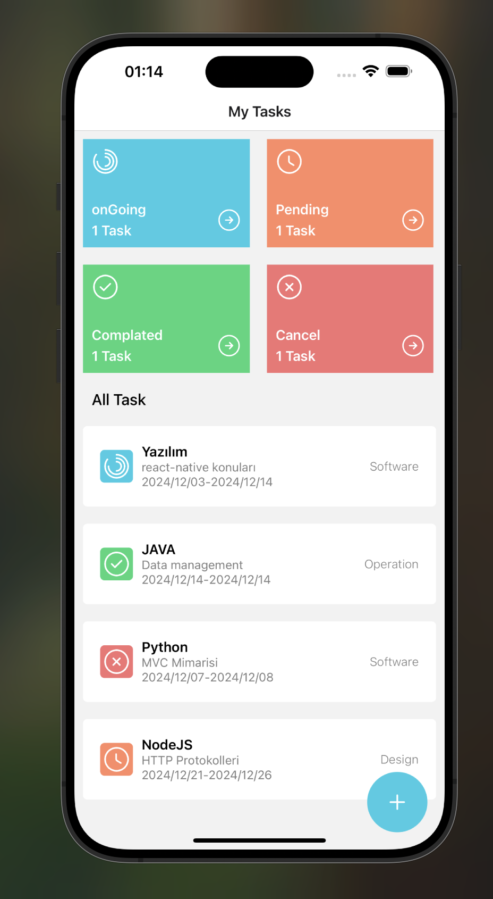
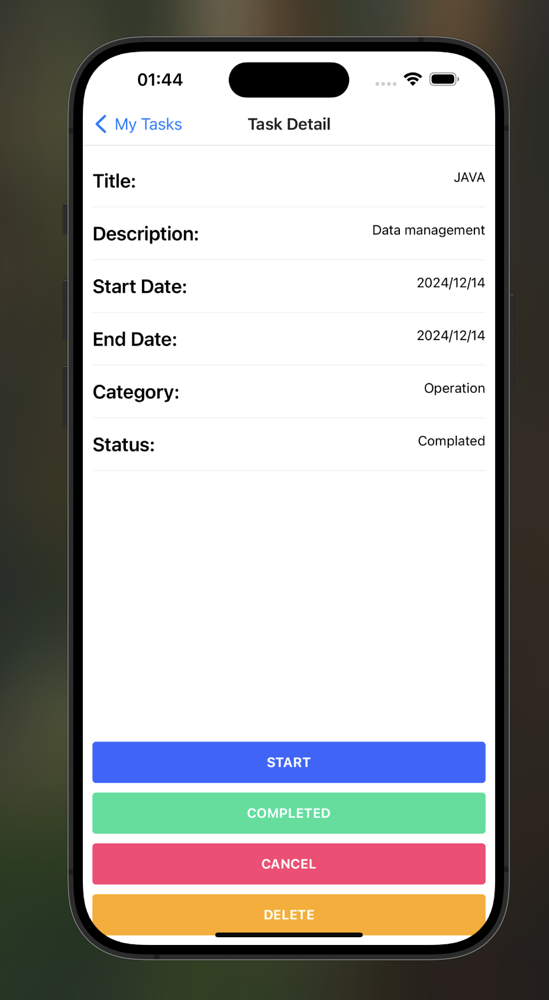
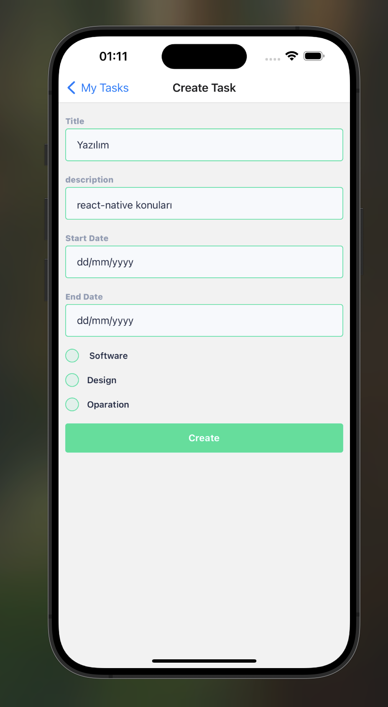

# Task Manager Application

This project is a Task Manager application built with React Native. Users can add, delete, and view the details of tasks. Additionally, users can update the task status to completed, pending, or canceled. All tasks are persistently stored using AsyncStorage.

## Screenshots 🖼️

### Video GIF


### HomePage



### TaskDetail



### AddTask



## Features

- Add, delete, and view tasks.
- Update task statuses: Completed, Pending, or Canceled.
- Persistent data storage using AsyncStorage.
- User-friendly and modern interface.

## Libraries Used

This project utilizes the following key libraries:

- @react-native-async-storage/async-storage: Persistent task storage.
- @react-navigation/native: Screen navigation.
- @ui-kitten/components: UI components.
- formik and yup: Form management and validation.
  moment: Date formatting.
- react-native-uuid: Unique ID generation for tasks.
- iconsax-react-native: Modern icons.

## Installation

Follow these steps to run the project locally:

1. Clone the repository:

```
git clone https://github.com/ozerbaykal/Formik-Yup-New_Task.git

cd Formik-Yup-New_Task

```

2. Install dependencies:

```
npm install

```

3. Run the app on a device or emulator:

- For Android:

```
npx react-native run-android


```

- For İOS:

```
npx react-native run-ios

```

## Screens

1. Home Screen

- Displays a list of all tasks.
- Users can delete tasks or update their statuses.

2. Add Task Screen

- Allows users to add new tasks.
- Form validation is implemented using Formik and Yup.

3. Task Detail Screen

- Displays details of the selected task.
- Users can update the task status or delete the task.

## Contributing

Contributions are welcome! Please open an issue first to discuss what you would like to change.

- 1.Fork the project
- 2.Create your feature branch (git checkout -b feature/NewFeature)
- 3.Commit your changes (git commit -m 'Add new feature')
- 4.Push to the branch (git push origin feature/NewFeature)
- 5.Open a Pull Request

## Contact 📬

**Özer BAYKAL**  
Email: [baykalozer87@gmail.com](mailto:baykalozer87@gmail.com)  
Project Link: [Movie App on GitHub](https://github.com/ozerbaykal/Formik-Yup-New_Task)
